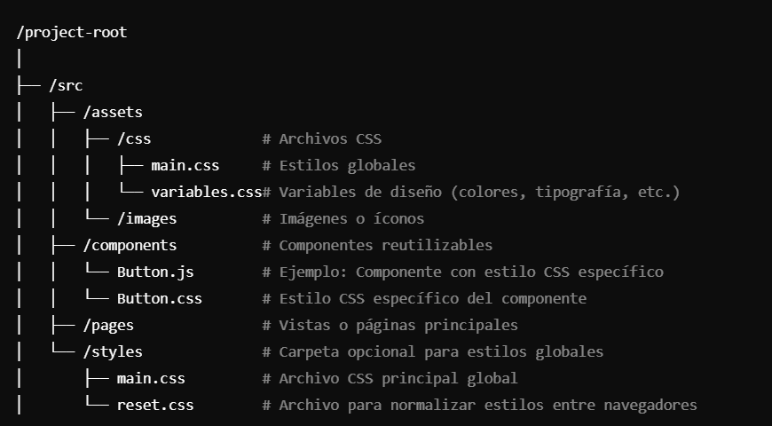

# Quorum360: Plataforma de Gestión para Propiedad Horizontal
Descripción del proyecto
Quorum360 es un software web diseñado para facilitar la gestión integral de la propiedad horizontal. La plataforma ofrece herramientas avanzadas y una interfaz intuitiva para optimizar procesos administrativos, comunicación interna y gestión de recursos en conjuntos residenciales y comerciales.

Este proyecto utiliza tecnologías modernas como React y Tailwind CSS para garantizar un diseño atractivo, escalabilidad y un rendimiento óptimo.

## Características principales
- Gestión de residentes : Registro y administración de propietarios, inquilinos y unidades.
- Comunicación eficiente : Envío de notificaciones y anuncios a los residentes.
- Control financiero : Gestión de cuotas de administración y estados de cuenta.
- Calendario de eventos : Organización de reuniones, actividades y reservas de espacios comunes.
- Galería interactiva : Presentación visual de servicios, zonas comunes y eventos destacados.
- Testimonios : Recopilación de opiniones de usuarios para mejorar la experiencia.

## Tecnologías utilizadas
- Interfaz : Html, CCS, Tailwind CSS y React 
- Backend (en desarrollo) : Node.js con Express
- Base de datos (en desarrollo) : MongoDB
- Control de versiones : Git/GitHub

## Estructura del Proyecto

Es un proyectos CSR (Client-Side Rendering)

